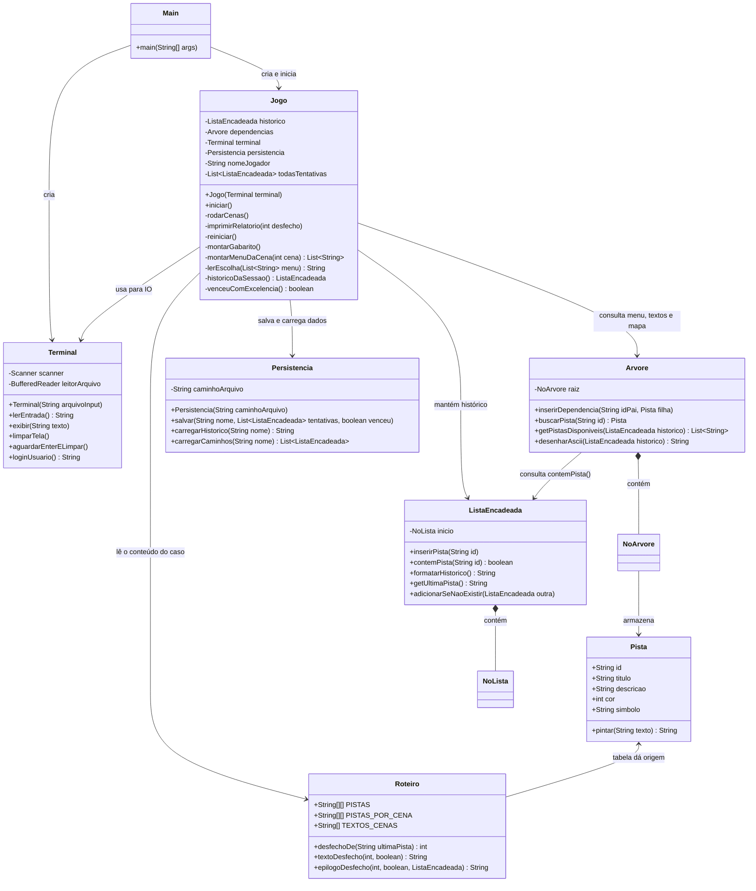

# Arquitetura do Projeto
### Jogo Investigativo — Estrutura de Dados (2º Período ADS)

Este documento descreve **o que cada classe faz**, **como elas se conversam** e
**como compilar, rodar e testar**. O racional das decisões de design (por que
cada regra é assim) está em `docs/Notas_de_Design.md`.

---

## 1. Visão Geral do Sistema

O jogo roda no terminal. O jogador (detetive) faz login e atravessa **5 cenas
fixas** do caso do desaparecimento do Dr. Almeida. Em cada cena escolhe uma
pista para investigar; cada escolha é registrada em uma **Lista Encadeada**
(o histórico) e o menu de opções é filtrado por uma **Árvore de dependências**
(uma pista só fica disponível quando seu "pai" já foi coletado).

Ao fim das 5 cenas, o desfecho é decidido pela **última pista coletada**:
vitória (com ou sem badge de excelência), dois finais alternativos malucos
(abdução / loucura) ou derrota. O jogo exibe um **epílogo narrativo**, depois
um **relatório unificado** com todas as tentativas do jogador (inclusive de
sessões anteriores) e um **mapa ASCII colorido** da árvore do caso, e grava
tudo em arquivo — um bloco por detetive.

---

## 2. Estrutura de Pastas

```
src/
├── Main.java                  ← ponto de entrada (pacote raiz)
├── engine/                    ← motor do jogo
│   ├── Jogo.java              ← as regras (fluxo, menu, desfecho, relatório)
│   ├── Roteiro.java           ← todo o conteúdo do caso (só dados)
│   ├── Persistencia.java      ← gravação/leitura em arquivo
│   ├── Terminal.java          ← toda a entrada e saída de tela
│   └── Pista.java             ← modelo de dado (id, textos, cor, símbolo)
└── estruturadados/            ← as estruturas da disciplina
    ├── Arvore.java  + NoArvore.java
    └── ListaEncadeada.java + NoLista.java

test_inputs/                   ← 6 scripts de teste (uma entrada por linha)
dados/partidas.txt             ← persistência (gerado em runtime, gitignored)
docs/                          ← esta documentação
```

---

## 3. Diagrama de Classes



---

## 4. O Que Cada Classe Faz

### `Main` (pacote raiz)
> **Liga tudo.** Lê `args[0]` (script opcional), cria o `Terminal` e o `Jogo`
> e chama `iniciar()`. Nenhuma lógica de jogo.

### `Terminal`
> **Único ponto de contato com o mundo externo.** Nenhuma outra classe usa
> `Scanner` ou `System.out.println` para a tela do jogo.

Com um arquivo de script, cada `lerEntrada()` devolve a próxima linha do
arquivo (ecoando na tela); sem arquivo, lê do teclado. As pausas
(`aguardarEnterELimpar`) e a limpeza de tela **não fazem nada no modo script**
— assim os testes não consomem linhas nem sujam a saída capturada.

| Método | O que faz |
|---|---|
| `Terminal(String arquivoInput)` | `null` = teclado; caminho = lê do script. |
| `lerEntrada()` | Próxima entrada, transparente à origem. |
| `exibir(String)` | Imprime uma linha. |
| `limparTela()` | Limpa a tela (ANSI); no-op no modo script. |
| `aguardarEnterELimpar()` | "Pressione ENTER" + limpa; no-op no modo script. |
| `loginUsuario()` | Cabeçalho + lê o nome do detetive. |

### `Roteiro`
> **Todo o conteúdo do caso num lugar só — apenas dados, nenhuma regra.**

- `PISTAS` — a tabela do gabarito: `{ pai, id, título, descrição[, cor][, símbolo] }`.
  A ordem importa (pai antes dos filhos; linhas com pai `null` definem a ordem
  do mapa). Colunas 5/6 opcionais: cor `"1"` importante (verde), `"2"`
  excelência (amarelo), padrão comum (azul); símbolo (★ 🛸 🌀) aparece no mapa
  quando a pista é coletada.
- `PISTAS_POR_CENA` — o que cada cena oferece (pistas-chave se repetem nas
  cenas seguintes até serem coletadas — o "transbordo").
- `TEXTOS_CENAS` — narrativa fixa das 5 cenas, com as pistas destacadas
  `[ENTRE COLCHETES]`.
- `desfechoDe(ultimaPista)` — classificador único de desfecho.
- `textoDesfecho(...)` / `epilogoDesfecho(...)` — os textos de resultado e os
  epílogos narrativos dos 5 finais (a derrota inclui feedback do que faltou).

### `Jogo`
> **As regras.** Controla o fluxo e não contém nenhum texto narrativo.

| Método | O que faz |
|---|---|
| `iniciar()` | Limpa a tela, faz login, carrega o histórico salvo (`carregarHistorico` para exibir + `carregarCaminhos` para semear `todasTentativas`), monta o gabarito e entra no loop. |
| `montarGabarito()` | Um loop sobre `Roteiro.PISTAS` alimentando a `Arvore` — a árvore vira a fonte única das pistas (até título e descrição são consultados nela). |
| `rodarCenas()` | Para cada cena: pausa, texto, menu filtrado, escolha, descrição pintada, registro no histórico. Ao fim: `Roteiro.desfechoDe(historico.getUltimaPista())` → relatório → revanche. |
| `montarMenuDaCena(cena)` | Lista da cena filtrada: sem duplicatas, sem coletadas, só com pré-requisito cumprido (`Arvore.getPistasDisponiveis`). |
| `lerEscolha(menu)` | Só aceita número válido; entrada inválida avisa e repete. |
| `imprimirRelatorio(desfecho)` | Epílogo → pausa → relatório unificado (todas as tentativas, com rótulo derivado de `desfechoDe`) → mapa ASCII colorido → resultado → `persistencia.salvar()`. |
| `reiniciar()` | Pergunta s/n; se sim, zera o histórico e roda as cenas de novo. |
| `historicoDaSessao()` | Agrega as pistas de todas as tentativas (sem repetição) para o mapa colorir tudo que já foi percorrido. |
| `venceuComExcelencia()` | `true` se a dupla `AUXILIARES` está no histórico da partida. |

### `Pista`
> **Modelo de dado com o papel visual embutido.** `cor` (0 comum/azul,
> 1 importante/verde, 2 excelência/amarelo) e `simbolo` vêm da tabela do
> Roteiro; `pintar(texto)` aplica o ANSI da cor — a regra de pintura vive
> num lugar só e é usada pelo mapa e pela descrição da pista escolhida.

### `ListaEncadeada` e `NoLista`
> **Estrutura de dados nº 1.** O histórico cronológico da investigação.

| Método | O que faz |
|---|---|
| `inserirPista(id)` | Adiciona no fim da lista. |
| `contemPista(id)` | `true` se o id já foi coletado (é o que a Árvore consulta). |
| `formatarHistorico()` | `"[a] -> [b] -> FIM"` (a exibição é do chamador, via Terminal). |
| `getUltimaPista()` | Id da última coletada (`null` se vazia) — define o desfecho. |
| `adicionarSeNaoExistir(outra)` | União sem repetição (usada pelo mapa da sessão). |

### `Arvore` e `NoArvore`
> **Estrutura de dados nº 2.** O gabarito do caso: raiz sentinela sem pista;
> filhos de um nó só ficam disponíveis quando o pai entra no histórico.

| Método | O que faz |
|---|---|
| `inserirDependencia(idPai, filha)` | `null` = filha da raiz; senão localiza o pai via DFS e adiciona. |
| `buscarPista(id)` | Devolve a `Pista` do nó — a árvore é a fonte única dos dados das pistas. |
| `getPistasDisponiveis(historico)` | DFS: devolve os **ids** cujos pais já estão no histórico (e que ainda não foram coletados). |
| `desenharAscii(historico)` | O mapa do caso: a árvore inteira com conectores `├─`/`└─`, colorindo (via `Pista.pintar`) só as pistas presentes no histórico. |

### `Persistencia`
> **Lembra os jogadores entre sessões.** Única classe que toca o sistema de
> arquivos. Formato: **um bloco por detetive**, com todas as rotas acumuladas:

```
>>> DETETIVE: nome
Tentativas: N
Último Resultado: Caso Solucionado | Investigação Mal Sucedida
  Caminho 1: [a] -> [b] -> FIM
  ...
----------------------------------------
```

| Método | O que faz |
|---|---|
| `Persistencia(caminho)` | Cria diretório e arquivo se não existirem. |
| `salvar(nome, todasTentativas, venceu)` | **Reescreve o arquivo inteiro**: blocos dos outros detetives intactos + bloco atualizado do jogador. |
| `carregarHistorico(nome)` | O bloco do jogador como texto (exibido no login); `""` na primeira vez. |
| `carregarCaminhos(nome)` | Reconstrói as `ListaEncadeada` das rotas salvas — semeia `todasTentativas` no login, por isso `salvar()` não precisa de merge. |

---

## 5. O Fluxo de Uma Partida

```
Main → Terminal → Jogo.iniciar()
  limparTela → login → histórico salvo (exibe + carrega caminhos)
  montarGabarito (tabela do Roteiro → Arvore)
  rodarCenas:  ┌ 5× [ENTER+limpa → cena → menu filtrado → escolha → registro]
               └ desfecho = Roteiro.desfechoDe(última pista)
  epílogo narrativo → ENTER+limpa → relatório unificado + mapa → salvar
  revanche? (s = zera o histórico e repete; n = encerra)
```

Desfechos possíveis (função da última pista): `celular_esquecido` → **vitória**
(com badge de excelência se coletou registro + testemunho do zelador);
`luz_estranha` → **abdução**; `mural_conspiracao` → **loucura**; qualquer
outra → **derrota** (com feedback do elo que faltou).

---

## 6. O Relatório Final

Após o epílogo, `imprimirRelatorio(int desfecho)` exibe **todas as tentativas
do jogador** (unificadas entre sessões — por isso não há carimbo de data) e o
mapa do caso:

```
============================================
         RELATÓRIO DE INVESTIGAÇÃO
============================================
Detetive  : Marple
Tentativas: 2

--- Tentativa 1 (FALHOU) ---
  [luvas_latex] -> [gaveta] -> [email_ameaca] -> [contrato_concorrente] -> [endereco_secreto] -> FIM
  ✗ "Endereço no Contrato" levou a um beco sem saída.

--- Tentativa 2 (SUCESSO) ---
  [cracha] -> [camera] -> [email_ameaca] -> [contrato_concorrente] -> [celular_esquecido] -> FIM

MAPA DO CASO:
  Toda pista COLORIDA já foi investigada por você.
  verde: pista-chave | amarelo: excelência | azul: pista comum

├─ Crachá de Acesso            ← colorido conforme o rastro do jogador
│  └─ Câmera de Segurança
│     ├─ Revirar Tudo ★
│     ...

Resultado : CASO RESOLVIDO — o Dr. Almeida forjou o próprio sumiço.
============================================
```

Rótulo de cada tentativa = `Roteiro.desfechoDe(última pista do caminho)`:
`SUCESSO`, `FINAL ALTERNATIVO` (sem linha de beco — finais malucos são
celebrados) ou `FALHOU` (+ linha de beco sem saída).

---

## 7. Como Compilar, Rodar e Testar

```bash
# compilar
javac -d bin $(find src -name "*.java")

# jogar no teclado
java -cp bin Main

# rodar um script de teste (uma entrada por linha: nome, escolhas, s/n)
java -cp bin Main test_inputs/vitoria.txt
```

Scripts disponíveis em `test_inputs/` (cobrem os 5 desfechos + revanche):

| Script | O que exercita |
|---|---|
| `vitoria.txt` | Caminho da vitória direto (crachá → câmera → Revirar Tudo). |
| `excelencia.txt` | Vitória + badge (registro na C3, zelador na C4). |
| `abducao.txt` | Trilha maluca da janela (🛸). |
| `loucura.txt` | Trilha maluca do café (🌀). |
| `derrota.txt` | Só distrações → arquivo morto, com feedback. |
| `revanche.txt` | Derrota → `s` → vitória (exercita `reiniciar()` e o relatório com múltiplas tentativas). |

No modo script as pausas de ENTER e a limpeza de tela são puladas
automaticamente — os arquivos **não** precisam de linhas em branco extras.
