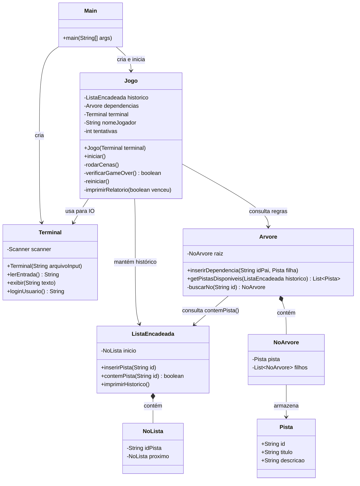

# Arquitetura e Organização do Projeto
### Jogo Investigativo — Estrutura de Dados (2º Período ADS)

Este documento descreve **o que cada classe faz**, **como elas se conversam** e **quem implementa cada parte**. Leia antes de começar a codificar.

---

## 1. Visão Geral do Sistema

O jogo roda no terminal. O jogador faz login, lê a narrativa de uma cena e escolhe qual pista investigar. O sistema registra cada escolha em uma **Lista Encadeada** (o histórico) e consulta uma **Árvore** (o gabarito lógico) para decidir o que acontece a seguir. Se a sequência de pistas for incorreta, o jogo exibe um **relatório** com o caminho percorrido e reinicia.

---

## 2. Diagrama de Classes

Cada caixa é uma classe Java. As setas mostram qual classe usa qual. As bolinhas cheias (`*--`) indicam que uma classe contém a outra.



> **Nota:** `verificarAcesso` foi removido como método público. A lógica de acesso está encapsulada dentro de `getPistasDisponiveis` — o `Jogo` nunca precisa validar individualmente; ele apenas pede "quais pistas estão disponíveis agora?" e usa o resultado.

---

## 3. O Que Cada Classe Faz

---

### `Main`
> **Ponto de entrada do programa.** Cria um `Terminal` e um `Jogo`, passa um para o outro e chama `iniciar()`. Não contém nenhuma lógica de jogo.

Se o jogo for chamado com um arquivo de script:
```bash
java Main test_inputs/vitoria.txt
```
A `Main` lê o argumento e passa para o `Terminal`, que vai usá-lo no lugar do teclado.

---

### `Terminal`
> **É o único ponto de contato entre o jogo e o mundo externo** — para exibir texto e para ler o que o jogador digita. Nenhuma outra classe usa `Scanner` ou `System.out.println` diretamente.

#### Por que existe essa classe?

O `Terminal` resolve um problema prático: **testar o jogo exige digitar todas as escolhas manualmente a cada execução**. Ao centralizar toda leitura aqui, é possível substituir o teclado por um arquivo de texto sem mudar nada no resto do jogo.

#### Como funciona em uma cena

A cada cena, o `Jogo` exibe o menu de pistas e chama `terminal.lerEntrada()` para saber a escolha do jogador. O `Terminal` devolve uma `String` — e não importa de onde ela veio:

**Modo teclado:**
```
[Menu: "1. Faca    2. Janela Arrombada"]
Jogo chama → terminal.lerEntrada()
Jogador digita "1" e aperta Enter
Terminal devolve → "1"
```

**Modo arquivo:**
```
[Menu: "1. Faca    2. Janela Arrombada"]
Jogo chama → terminal.lerEntrada()
Terminal lê a próxima linha do arquivo .txt → "1"
Terminal devolve → "1"
```

O comportamento do jogo é **idêntico nos dois casos**.

#### Como montar o arquivo de script

Cada linha do arquivo é uma entrada que o jogador daria, na ordem em que o jogo vai pedi-las:

```
Andre
1
2
1
```
Linha 1 → nome do jogador (login)
Linha 2 → escolha na Cena 1
Linha 3 → escolha na Cena 2
Linha 4 → escolha na Cena 3

#### Métodos

| Método | O que faz |
|---|---|
| `Terminal(String arquivoInput)` | Se `arquivoInput` for `null`, lê do teclado. Se for um caminho de arquivo, lê dali. |
| `lerEntrada()` | Retorna a próxima linha — do teclado ou do arquivo, de forma transparente. |
| `exibir(String texto)` | Imprime texto na tela. |
| `loginUsuario()` | Pede o nome do jogador e retorna como String. |

---

### `Jogo`
> **O coração do sistema.** Controla o fluxo: login, cenas, validação, relatório e reinício. Não faz IO diretamente — sempre delega ao `Terminal`.

| Método | O que faz |
|---|---|
| `iniciar()` | Faz o login, monta a `Arvore` com o gabarito do caso e entra no loop de cenas. |
| `rodarCenas()` | Para cada cena, chama `getPistasDisponiveis()` na Árvore, exibe o menu, lê a escolha e insere na `ListaEncadeada`. Ao final de cada cena, checa se houve Game Over. |
| `verificarGameOver()` | Verifica se a última pista inserida não tem filhos na Árvore (beco sem saída) ou leva a um ramo incorreto. Retorna `true` se o jogo terminou. |
| `reiniciar()` | Incrementa `tentativas`, limpa o histórico (`historico = new ListaEncadeada()`) e volta ao início de `rodarCenas()`. |
| `imprimirRelatorio(boolean venceu)` | Exibe o relatório final (ver seção 4). |

---

### `Pista`
> **Objeto de dados puro.** Representa uma evidência. Não tem lógica — apenas armazena informação.

```java
Pista faca = new Pista("faca", "Faca de cozinha", "Uma faca com manchas escuras na lâmina.");
```

Ter a classe `Pista` permite que a `Arvore` carregue o texto da evidência junto com o nó. O `Jogo` lê a descrição diretamente do nó e exibe ao jogador — sem `if/switch` gigante.

---

### `ListaEncadeada` e `NoLista`
> **Estrutura de dados nº 1.** Registra cronologicamente todas as pistas coletadas pelo jogador — é o "histórico da investigação".

Cada escolha do jogador é adicionada ao final da lista com `inserirPista(id)`. Ao exibir o relatório, `imprimirHistorico()` mostra:

```
[faca] -> [impressao_digital] -> [suspeito_capturado] -> FIM
```

**Por que `contemPista(String id)` existe:** A `Arvore` precisa saber se o jogador já coletou determinada pista antes de liberar as próximas. Em vez de receber a lista inteira e navegar por ela mesma, a `Arvore` simplesmente pergunta à lista: *"você contém essa pista?"* e recebe um `boolean`. As duas estruturas permanecem independentes.

| Método | O que faz |
|---|---|
| `inserirPista(String id)` | Cria um `NoLista` com o id e adiciona no fim da lista. |
| `contemPista(String id)` | Percorre a lista e retorna `true` se o id foi encontrado. |
| `imprimirHistorico()` | Imprime todas as pistas no formato `A -> B -> C -> FIM`. |

---

### `Arvore` e `NoArvore`
> **Estrutura de dados nº 2.** É o gabarito do caso. Define quais pistas existem, quais dependem de quais, e qual é o caminho correto.

Cada `NoArvore` guarda uma `Pista` e uma lista de filhos. Os filhos de um nó só ficam acessíveis se a pista do nó pai já foi coletada. Exemplo de como o gabarito é estruturado:

```
Raiz (nó inicial, sem pista)
├── NÓ: "faca"
│   ├── NÓ: "impressao_digital"   ← caminho correto → leva à vitória
│   └── NÓ: "marca_de_bota"       ← caminho errado → Game Over
└── NÓ: "janela_arrombada"
    └── NÓ: "fibra_de_tecido"     ← caminho errado → Game Over
```

**Como o `getPistasDisponiveis()` funciona:** A `Arvore` percorre todos os seus nós e, para cada um, pergunta à `ListaEncadeada` se o nó pai já foi coletado. Se sim, a pista daquele nó entra na lista de disponíveis. O `Jogo` usa essa lista para montar o menu de cada cena — o menu é montado dinamicamente pelas estruturas, sem lógica hardcoded no `Jogo`.

| Método | O que faz |
|---|---|
| `inserirDependencia(String idPai, Pista filha)` | Localiza o nó `idPai` na árvore via `buscarNo()` e adiciona `filha` como filho. É assim que o gabarito é montado em `iniciar()`. |
| `getPistasDisponiveis(ListaEncadeada historico)` | Retorna todas as pistas cujo nó pai já está no histórico. Encapsula também a validação de acesso — não existe método `verificarAcesso` separado. |
| `buscarNo(String id)` *(privado)* | Busca recursivamente o nó com o `id` informado. Usado internamente por `inserirDependencia`. |

---

## 4. O Relatório Final

O requisito da matéria exige que o sistema **demonstre o resultado final dos dados em forma de relatório**. O método `imprimirRelatorio(boolean venceu)` no `Jogo` é responsável por isso.

Ele deve exibir um bloco formatado ao final de cada partida — tanto na vitória quanto na derrota:

```
============================================
         RELATÓRIO DE INVESTIGAÇÃO
============================================
Detetive : Andre
Tentativas: 2

Caminho percorrido:
  [faca] -> [marca_de_bota] -> FIM

Resultado : CASO NÃO RESOLVIDO
A pista "marca_de_bota" levou a um beco sem saída.
O caminho correto passava por "impressao_digital".
============================================
```

Em caso de vitória:
```
============================================
         RELATÓRIO DE INVESTIGAÇÃO
============================================
Detetive : Andre
Tentativas: 1

Caminho percorrido:
  [faca] -> [impressao_digital] -> [suspeito_capturado] -> FIM

Resultado : CASO RESOLVIDO — Suspeito identificado!
============================================
```

O relatório usa exclusivamente os dados já armazenados nas estruturas:
- **Nome do jogador** → `nomeJogador` (armazenado no `Jogo` após o login)
- **Tentativas** → `tentativas` (incrementado a cada `reiniciar()`)
- **Caminho percorrido** → `historico.imprimirHistorico()` (a `ListaEncadeada` em ação)
- **Resultado e análise** → lógica do `Jogo` com base no último nó alcançado na `Arvore`

---

## 5. Divisão de Tarefas — Final de Semana

### Módulo 1 — Estruturas de Dados (Desenvolvedor A)
**Arquivos:** `Pista.java`, `NoLista.java`, `ListaEncadeada.java`, `NoArvore.java`, `Arvore.java`

- Implementar `Pista` (só atributos e construtor).
- Implementar `NoLista` e `ListaEncadeada` com todos os métodos listados na seção 3.
- Implementar `NoArvore` e `Arvore`, incluindo o método **privado** `buscarNo()`.
- Testar localmente antes de subir no repositório: inserir pistas na lista e confirmar que `contemPista()` funciona; montar uma árvore pequena e confirmar que `getPistasDisponiveis()` retorna os nós corretos.

**Prazo:** Sábado de manhã.

---

### Módulo 2 — Motor do Jogo e Narrativa (Desenvolvedor B)
**Arquivos:** `Jogo.java`

- Escrever o roteiro: textos das 3 cenas e descrições das pistas (vão para os objetos `Pista`).
- Dentro de `iniciar()`, montar a `Arvore` com `inserirDependencia()` — este é o gabarito do caso.
- Implementar `rodarCenas()`, `verificarGameOver()`, `reiniciar()` e `imprimirRelatorio()`.
- Não usar `Scanner` ou `System.out.println` diretamente — sempre `terminal.lerEntrada()` e `terminal.exibir()`.

**Prazo:** Sábado de manhã (narrativa e estrutura do loop). Integração no Sábado à tarde.

---

### Módulo 3 — Interface, IO e Scripts (Desenvolvedor C)
**Arquivos:** `Terminal.java`, `Main.java`, `test_inputs/vitoria.txt`, `test_inputs/derrota.txt`

- Implementar `Terminal` conforme descrito na seção 3.
- Implementar `Main`: ler `args[0]` (se existir), criar `Terminal` e `Jogo`, chamar `iniciar()`.
- Criar os arquivos de script: `vitoria.txt` com a sequência correta e `derrota.txt` com uma sequência incorreta.

**Prazo:** Sábado de manhã — **os scripts de teste devem estar prontos antes da integração** para que toda a equipe valide o jogo sem digitar nada.

---

### Integração e Testes (Todos Juntos)

**Sábado à tarde:**
1. Dev A entrega as estruturas no repositório.
2. Dev B e C integram na `Main` e no `Jogo`.
3. Rodar `java Main test_inputs/vitoria.txt` e `java Main test_inputs/derrota.txt` para validar o fluxo completo.
4. Corrigir os bugs encontrados.

**Domingo:**
- Garantir estabilidade do `reiniciar()` — jogar, perder, reiniciar, jogar de novo.
- Polir a apresentação visual no terminal (separadores, arte ASCII, mensagens de Game Over).
- Ensaiar a apresentação usando o modo automatizado.
