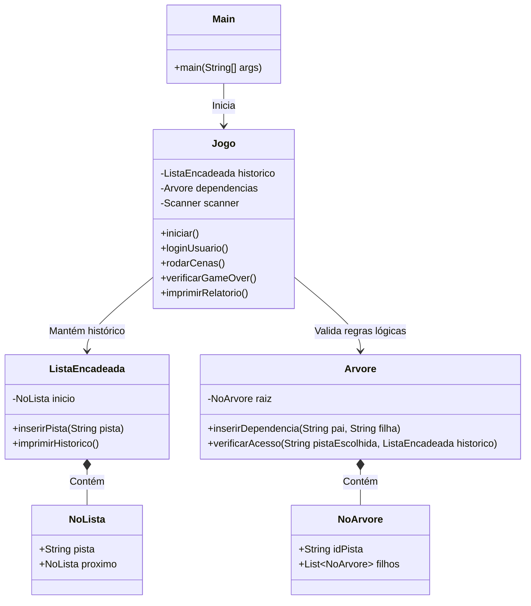

# Arquitetura e Organização do Projeto

Considerando o prazo de um fim de semana e os conhecimentos esperados do 2º período de ADS, a arquitetura deve ser concisa e bem "fechada" (coesão forte e baixo acoplamento). A seguir está a especificação técnica de como o sistema deve ser estruturado.

---

## 1. Diagrama de Classes e Interações

O sistema é focado exclusivamente nas estruturas de dados solicitadas. 

### Como as Classes Interagem:
1. **`Main`** apenas invoca `Jogo.iniciar()`.
2. O **`Jogo`** inicializa a `Arvore` preenchendo as regras lógicas (ex: a pista "Pegadas" destrava "Sapato").
3. Durante as cenas do **`Jogo`**, o jogador escolhe uma evidência. O **`Jogo`** pergunta à **`Arvore`**: `verificarAcesso()`. A Árvore analisa o `historico` da **`ListaEncadeada`** para ver se o jogador tinha a pista anterior necessária.
4. Se sim, o **`Jogo`** faz um `inserirPista()` na **`ListaEncadeada`**.
5. Se o jogador errar a dedução (chegar a um ponto incorreto), o sistema invoca `imprimirRelatorio()`, que renderiza a Lista Encadeada no console, mostrando a falha.

---

## 2. Divisão de Tarefas para o Final de Semana (3 Desenvolvedores)

O trabalho será dividido por "Módulos" fechados. Assim, a equipe pode programar paralelamente no Sábado e integrar no Domingo.

### Módulo 1: Lista Encadeada (Desenvolvedor A)
- **Responsabilidade:** Criar do zero as classes `NoLista` e `ListaEncadeada`.
- **Regras:** A lista deve guardar Strings (nomes das pistas). O método de impressão no console deve ter uma interface visual amigável (ex: `Pista 1 -> Pista 2 -> Fim`).
- **Prazo Ideal:** Sábado de manhã.

### Módulo 2: Árvore Hierárquica (Desenvolvedor B)
- **Responsabilidade:** Criar do zero as classes `NoArvore` e `Arvore`.
- **Regras:** Como uma pista pode liberar mais de uma evidência (ex: achar a arma libera "Exame de Sangue" e "Impressões Digitais"), o `NoArvore` precisa ter uma lista de filhos genérica (não pode ser Árvore Binária).
- **Prazo Ideal:** Sábado de manhã.

### Módulo 3: Jogo, Interface e Entradas (Desenvolvedor C)
- **Responsabilidade:** Classe `Jogo` e interface no terminal.
- **Regras:** Deve cuidar do sistema de login (apenas armazenando o nome da sessão) e estruturar a leitura do teclado (`Scanner`). É fundamental criar um método automatizado (ler os inputs de um arquivo `.txt` ao invés do teclado) para que na apresentação final o jogo "rode sozinho".
- **Prazo Ideal:** Sábado de manhã.

### Integração e Regras de Negócio (Todos Juntos)
- **Responsabilidade:** Ligar a Lista, a Árvore e o Jogo.
- **Cronograma de Integração (Sábado de Tarde):** Instanciar a Árvore com as pistas oficiais e inserir a lógica das cenas no `while` principal.
- **Testes e Polimento (Domingo):** Validar se o cenário de "Game Over" reseta o jogo corretamente, se a Lista limpa (`historico = null`) e se a renderização final do relatório atende aos requisitos do professor.
