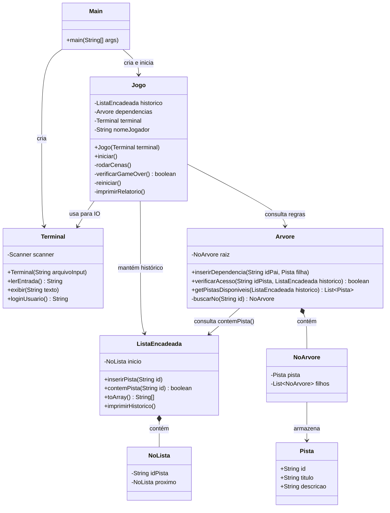

# Arquitetura e Organização do Projeto
### Jogo Investigativo — Estrutura de Dados (2º Período ADS)

Este documento descreve **como o sistema é organizado**, **o que cada classe faz**, **como elas se conversam** e **quem deve implementar cada parte**. Leia com atenção antes de começar a codificar.

---

## 1. Visão Geral do Sistema

O jogo roda no terminal. O jogador faz login, lê a narrativa de uma cena e escolhe qual pista investigar. O sistema registra cada escolha em uma **Lista Encadeada** (o histórico) e consulta uma **Árvore** (o gabarito lógico) para decidir o que acontece a seguir. Se a sequência de pistas for incorreta, o jogo exibe o caminho errado e reinicia.

```
[Jogador digita] → [Terminal lê] → [Jogo decide] → [Arvore valida] → [Lista registra]
                                        ↓
                              [Relatório / Reinício]
```

---

## 2. Diagrama de Classes

Cada caixa é uma classe Java. As setas mostram qual classe usa qual. As bolinhas cheias (`*--`) indicam que uma classe contém a outra (composição).



---

## 3. O Que Cada Classe Faz (Explicação Detalhada)

---

### `Main`
> **Ponto de entrada do programa.** É a única classe que tem o método `main`. Ela cria um `Terminal` e um `Jogo`, passa um para o outro e dá o `iniciar()`. É propositalmente simples — não contém lógica de jogo.

Se o usuário rodar o jogo assim:
```bash
java Main script_vencedor.txt
```
A `Main` lê o argumento `script_vencedor.txt` e passa para o `Terminal`, que vai usar o arquivo no lugar do teclado.

---

### `Terminal`
> **Toda a comunicação com o usuário passa por aqui.** Nenhuma outra classe deve usar `Scanner` ou `System.out.println` diretamente. Isso mantém o restante do código limpo e testável.

**Por que isso é importante?** Porque se você quiser testar o jogo sem digitar nada (rodar um script automático para a apresentação), basta criar um `Terminal` que lê de um arquivo `.txt`. O `Jogo` não precisa nem saber disso — ele continua chamando `terminal.lerEntrada()` normalmente.

| Método | O que faz |
|---|---|
| `Terminal(String arquivoInput)` | Se `arquivoInput` for `null`, usa o teclado (`System.in`). Se for um caminho de arquivo, lê dali. |
| `lerEntrada()` | Retorna a próxima linha digitada (ou a próxima linha do arquivo). |
| `exibir(String texto)` | Faz o `System.out.println`. |
| `loginUsuario()` | Pede o nome do jogador e retorna como String. |

---

### `Jogo`
> **O coração do sistema.** Controla o fluxo do jogo: login, cenas, validação, relatório e reinício. Não faz IO diretamente — sempre pede ao `Terminal`.

**Por que `Jogo` recebe `Terminal` no construtor?** Para que Dev B (dono do `Jogo`) nunca precise mexer no código de IO. Se o `Terminal` mudar, o `Jogo` não muda. Isso é o que chamamos de baixo acoplamento.

| Método | O que faz |
|---|---|
| `iniciar()` | Chama `loginUsuario()`, monta a `Arvore` com as pistas do caso e entra no loop de cenas. |
| `rodarCenas()` | Itera pelas cenas (3 a 5). Em cada cena, chama `dependencias.getPistasDisponiveis(historico)` para saber quais pistas mostrar, exibe o menu, lê a escolha do jogador e insere na `ListaEncadeada`. |
| `verificarGameOver()` | Verifica se a última pista inserida leva a um beco sem saída na Árvore (caminho inválido). Retorna `true` se o jogo acabou. |
| `reiniciar()` | Limpa o histórico (`historico = new ListaEncadeada()`) e volta para o início de `rodarCenas()`. |
| `imprimirRelatorio()` | Chama `historico.imprimirHistorico()` para mostrar o caminho percorrido, e explica onde o jogador errou. |

---

### `Pista`
> **Objeto de dados simples.** Representa uma evidência do caso. Não tem lógica — só guarda informação.

```java
// Exemplo de como uma pista é criada no Jogo
Pista faca = new Pista("faca", "Faca de cozinha", "Uma faca com manchas escuras na lâmina.");
```

Ter uma classe `Pista` em vez de usar apenas `String` permite que a `Arvore` armazene o texto descritivo da evidência junto com o ID. O `Jogo` simplesmente pega a descrição do nó e exibe para o jogador — sem precisar de um `if/switch` gigante.

---

### `ListaEncadeada` e `NoLista`
> **Estrutura de dados principal nº 1.** Registra cronologicamente as pistas que o jogador coletou. É o "histórico da investigação".

Cada vez que o jogador escolhe uma pista, ela é adicionada ao final da lista com `inserirPista(id)`. No final do jogo, `imprimirHistorico()` exibe algo como:

```
[faca] -> [impressao_digital] -> [suspeito_capturado] -> FIM
```

**⚠️ Ponto de atenção — `contemPista(String id)`:** Este método percorre a lista nó por nó e retorna `true` se a pista de ID informado já foi coletada. Ele existe para que a `Arvore` possa fazer sua verificação **sem precisar enxergar a estrutura interna da lista**. A `Arvore` apenas pergunta: *"o jogador já tem a pista X?"* e recebe um `boolean`. Simples e fechado.

| Método | O que faz |
|---|---|
| `inserirPista(String id)` | Cria um `NoLista` com o id e o adiciona no fim da lista. |
| `contemPista(String id)` | Percorre a lista e retorna `true` se o id foi encontrado. |
| `toArray()` | Retorna todas as pistas como array — útil para o relatório. |
| `imprimirHistorico()` | Percorre a lista e imprime no formato visual `A -> B -> C -> FIM`. |

---

### `Arvore` e `NoArvore`
> **Estrutura de dados principal nº 2.** É o "gabarito" do caso. Define quais pistas existem, quais dependem de quais, e qual é o caminho correto até a solução.

Cada `NoArvore` guarda uma `Pista` e uma lista de filhos. A raiz da árvore é a pista inicial disponível para todos. Os filhos só ficam acessíveis se a pista do nó pai já foi coletada.

```
Raiz: [Cena 1] "Corpo encontrado"
├── NÓ: Pista "faca" (sempre visível na cena 1)
│   ├── NÓ: Pista "impressao_digital"   ← só aparece se "faca" foi coletada
│   └── NÓ: Pista "marca_de_bota"       ← leva ao caminho errado
└── NÓ: Pista "janela_arrombada" (sempre visível na cena 1)
    └── NÓ: Pista "fibra_de_tecido"     ← outro caminho errado
```

| Método | O que faz |
|---|---|
| `inserirDependencia(String idPai, Pista filha)` | Encontra o nó com `idPai` na árvore (via `buscarNo`) e adiciona `filha` como filho dele. É assim que o gabarito é montado dentro de `Jogo.iniciar()`. |
| `verificarAcesso(String idPista, ListaEncadeada historico)` | Checa se o jogador pode coletar a pista de id `idPista` — ou seja, se o nó pai dela já está em `historico`. Usa `historico.contemPista()` para isso. |
| `getPistasDisponiveis(ListaEncadeada historico)` | Percorre a árvore e retorna uma lista de todas as `Pista`s cujos pais já estão no histórico. O `Jogo` usa isso para montar o menu de escolhas de cada cena. |
| `buscarNo(String id)` *(privado)* | Busca recursivamente na árvore o nó com o `id` informado. É usado internamente por `inserirDependencia`. Sem ele, é impossível construir a árvore corretamente. |

---

## 4. A Interação Central (Por Que Isso Funciona)

O momento mais importante do jogo — e o mais relevante para a nota — é quando o `Jogo` chama `getPistasDisponiveis()`. Veja o que acontece internamente:

```
Jogo pergunta: "Quais pistas estão disponíveis agora?"
    ↓
Arvore percorre seus nós
    ↓
Para cada nó, pergunta à ListaEncadeada: "Você contém o pai deste nó?"
    ↓
ListaEncadeada percorre seus nós e responde: "Sim" ou "Não"
    ↓
Arvore monta a lista de pistas disponíveis e devolve para o Jogo
    ↓
Jogo exibe o menu para o jogador
```

As **duas estruturas de dados trabalhando juntas**, de forma independente e com responsabilidades claras. É exatamente isso que o professor quer ver.

---

## 5. Divisão de Tarefas — Final de Semana

### Módulo 1 — Estruturas de Dados (Desenvolvedor A)
**Arquivos:** `NoLista.java`, `ListaEncadeada.java`, `NoArvore.java`, `Arvore.java`, `Pista.java`

- Implementar `NoLista` e `ListaEncadeada` com todos os métodos da seção 3.
- Implementar `NoArvore` e `Arvore`, incluindo o método **privado** `buscarNo()`.
- Implementar `Pista` (simples — só atributos e construtor).
- Testar localmente: criar uma `ListaEncadeada`, inserir 3 pistas, confirmar que `contemPista()` funciona. Criar uma `Arvore`, inserir dependências e confirmar que `getPistasDisponiveis()` retorna os nós certos.

**Prazo:** Sábado de manhã. Ao terminar, disponibilizar os arquivos no repositório para que Dev B e Dev C possam integrá-los.

---

### Módulo 2 — Motor do Jogo e Narrativa (Desenvolvedor B)
**Arquivos:** `Jogo.java`

- Escrever o roteiro: textos das 3 cenas e descrições das 5+ pistas (esses textos vão para os objetos `Pista`).
- Dentro de `iniciar()`, montar a `Arvore` chamando `inserirDependencia()` — este é o gabarito do caso.
- Implementar `rodarCenas()`, `verificarGameOver()`, `reiniciar()` e `imprimirRelatorio()`.
- **Dev B não toca em `Scanner` ou `System.out` diretamente** — usa sempre `terminal.lerEntrada()` e `terminal.exibir()`.

**Prazo:** Sábado de manhã (narrativa e estrutura do loop). Integração no Sábado à tarde com Dev A e C.

---

### Módulo 3 — Interface, IO e Scripts (Desenvolvedor C)
**Arquivos:** `Terminal.java`, `Main.java` + arquivos `.txt` em `test_inputs/`

- Implementar `Terminal`: se receber um caminho de arquivo no construtor, o `Scanner` lê do arquivo; se receber `null`, lê de `System.in`. Isso é feito uma vez e nunca mais precisa mudar.
- Implementar `Main`: receber o argumento `args[0]` (se existir), criar `Terminal` e `Jogo`, chamar `iniciar()`.
- Criar os scripts de teste em `test_inputs/`: um arquivo `vitoria.txt` com a sequência de escolhas que leva à vitória e um `derrota.txt` com uma sequência que leva ao Game Over.

**Prazo:** Sábado de manhã — **o script de teste deve estar pronto antes da integração**, para que toda a equipe possa testar sem digitar nada.

---

### Integração e Testes (Todos Juntos)

**Sábado à tarde:**
1. Dev A entrega as estruturas de dados no repositório.
2. Dev B e C integram as classes na `Main` e no `Jogo`.
3. Rodar `java Main test_inputs/vitoria.txt` e `java Main test_inputs/derrota.txt` para validar o fluxo completo.
4. Corrigir bugs encontrados nos testes automatizados.

**Domingo:**
- Garantir estabilidade do `reiniciar()` (jogar, perder, reiniciar, jogar de novo).
- Polir os textos exibidos no terminal (arte ASCII, separadores visuais, mensagens de Game Over).
- Ensaiar a apresentação usando o modo automatizado (`vitoria.txt`).
